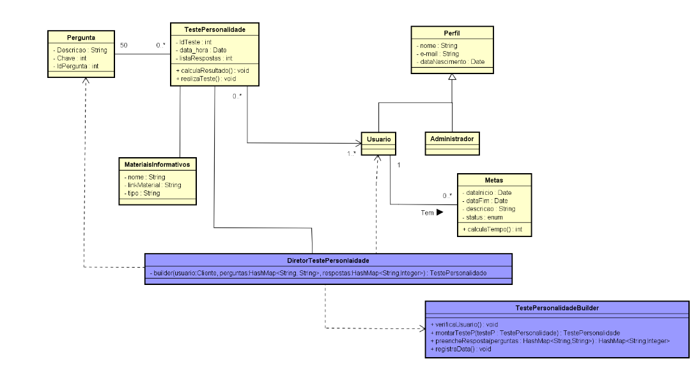

# Delphos_chernobyl
```
Delphos inicialmente foi um projeto de alunas de graduação do Ifes Campus Serra, nesse repositório vamos fazer uma versão redizida para aprendizados de Django.
```
1.1 Minimundo
A Canopus Tecnologia propõe um sistema chamado Delphos - Inteligência Emocional, um sistema que tem como objetivo guiar os usuários na jornada pelo autoconhecimento, autodesenvolvimento e plenitude emocional; Contribuindo assim para mitigar pensamentos danosos, controlar impulsos destrutivos dentre outras ações negativas, impedindo que esses transtornos venham a atrapalhar os usuários em sua vida. No primeiro contato, é necessário coletar algumas informações sobre o usuário. É necessário que ele informe nome, data de nascimento e e-mail. Posteriormente, o mesmo pode acrescentar mais informações ao cadastro. Em seguida, é necessário conhecer melhor o usuário. Assim, ele é submetido a um teste - Conhecido como Big 5, e o diagnóstico revelado pelo teste é exibido para o usuário e armazenado em um banco de dados. Nesse teste são realizadas cinquenta perguntas, divididas em cinco categorias: (i) extroversão, (ii) estabilidade emocional, (iii) afabilidade, (iv) consciência e (v) abertura para experiências. Na seguinte tabela, estão descritas as perguntas (que ainda não foram traduzidas) e sua respectiva sigla.

1.2 UML


1.3
|Funcionalidade|implementado|
|-------------------|--|
|Cadastro de usuário|não|
|Questionário com 5 perguntas|não|
|Média de cada categoria para o usuário|não|
|Calculo de moda para o usuário |não|
|Gráfico com média de todos usuários por idade 18 até 24, 25 até 35 e 30 ++|não|
|Gráfico com moda de todos usuários por idade 18 até 24, 25 até 35 e 30 ++|não|
|Gráfico com quantidade de usuários cadastrados por idade|não|
